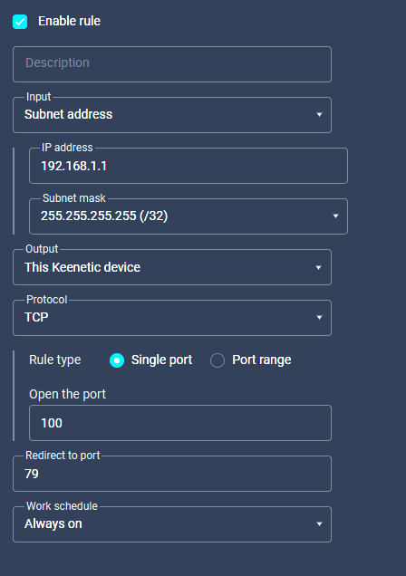
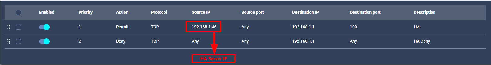

# Keenetic Router Pro - Home Assistant Integration

[](https://github.com/custom-components/hacs)
[](https://github.com/)

An advanced Home Assistant integration for Keenetic routers. Provides mesh network management, VPN control, device tracking, and more.

## 🌟 Features

### 📡 Real Time Device Tracking

* Real-time device status via **ICMP Ping**
* Selectable client list
* 5-second update interval
* Automatic updates on IP address changes

### 🔗 Mesh Network Management

* Status of all extenders/repeaters (binary sensors)
* Separate **reboot button** for each mesh node
* CPU, RAM, and uptime information
* **Firmware update notification** (update available sensor)
* Number of connected clients (associations)

### 🔐 VPN Management

* Enable/disable WireGuard profiles (switch)
* OpenVPN, IPsec, L2TP, PPTP support
* VPN uptime, RX/TX sensors

### 📶 WiFi Control

* Enable/disable switch for each SSID
* Guest WiFi control

### 🌐 WAN Status

* Real **WAN IP address** (PPPoE supported)
* Connection status sensor
* Uptime information

### 👥 Client Management

* Number of connected / disconnected devices
* **Connection Policy selection** (per client)

  * Default, VPN, No VPN, Smart Home, Roblox, etc.
  * Deny (block internet access)
* **Event trigger** when a new device connects

### 🔘 Buttons

* Router reboot
* Mesh node reboot (separate for each node)

---

## 📦 Installation

### Via HACS (Recommended)

1. HACS > Integrations > ⋮ > Custom repositories
2. URL: `https://github.com/YOUR_USERNAME/keenetic_router_pro`
3. Category: Integration
4. Search for "Keenetic Router Pro" and install
5. Restart Home Assistant

### Manual Installation

1. Copy the `keenetic_router_pro` folder into `config/custom_components/`
2. Restart Home Assistant

---

## ⚙️ Configuration

## 🔒 Security, Firewall & Port Forwarding

To use this integration **securely**, it is strongly recommended to configure **Firewall rules** and **Port Forwarding** properly on your Keenetic router. This section explains *why* it matters and *how* to do it.

### ⚠️ Why Firewall Configuration Is Important

* Home Assistant communicates with the router via its **web management API**
* Exposing router services directly to the internet **without restrictions** is a security risk
* Proper firewall rules ensure:

  * Only trusted devices (Home Assistant) can access the router
  * No unintended WAN access to router management services

Think of the firewall as a bouncer with a clipboard. Only invited guests get in.

---

### 🔌 Port Forwarding

#### How to Configure Port Forwarding
1. Enable UPnP if it is not
2. Go to **Internet > Port forwarding**
3. Add a new rule:

| Setting       | Value                              |
| ------------- | ---------------------------------- |
| Service       | Home Assistant Router API          |
| Protocol      | TCP                                |
| External Port | `100`   |
| Internal IP   | Router LAN IP (e.g. `192.168.1.1`) |
| Internal Port | `79`                               |



🚫 **Never expose port 80/443 to WAN without firewall rules**

---

### 🛡️ Firewall Rules (Recommended & Safe)

Instead of opening ports globally, use **Firewall rules** to restrict access.

#### Recommended Firewall Setup

1. Go to **Network Rules > Firewall**
2. Create a new rule:

| Option      | Value                                   |
| ----------- | --------------------------------------- |
| Direction   | Input                                   |
| Source      | Home Assistant IP (e.g. `192.168.1.50`) |
| Destination | Router                                  |
| Service     | HTTP / HTTPS / Custom port              |
| Action      | Allow                                   |

3. Create a second rule:

| Option      | Value        |
| ----------- | ------------ |
| Direction   | Input        |
| Source      | Any          |
| Destination | Router       |
| Service     | HTTP / HTTPS |
| Action      | Deny         |

✅ This ensures **only Home Assistant** can talk to the router API.


---

### 🔐 Best Security Practices

---

### 1. Add the Integration

Settings > Devices & Services > Add Integration > **Keenetic Router Pro**

### 2. Connection Details

| Field    | Description        | Example       |
| -------- | ------------------ | ------------- |
| Host     | Router IP address  | `192.168.1.1` |
| Port     | Web interface port | `100` |
| Username | Admin username     | `admin`       |
| Password | Admin password     | `********`    |

### 3. Select Devices to Track

During setup, you can choose which devices should be monitored via ping.

---

## 📊 Created Entities

### Sensors

| Entity                               | Description                    |
| ------------------------------------ | ------------------------------ |
| `sensor.router_wan_ip`               | WAN IP address                 |
| `sensor.router_wan_status`           | WAN status (up/down)           |
| `sensor.router_connected_clients`    | Number of connected devices    |
| `sensor.router_disconnected_clients` | Number of disconnected devices |
| `sensor.router_extenders`            | Number of mesh extenders       |
| `sensor.mesh_*_firmware`             | Mesh node firmware version     |
| `sensor.wireguard_*_uptime`          | VPN uptime                     |
| `sensor.wireguard_*_rx`              | VPN downloaded data            |
| `sensor.wireguard_*_tx`              | VPN uploaded data              |

### Binary Sensors

| Entity                                  | Description                 |
| --------------------------------------- | --------------------------- |
| `binary_sensor.mesh_*`                  | Mesh node connection status |
| `binary_sensor.mesh_*_update_available` | Firmware update available   |

### Switches

| Entity               | Description                      |
| -------------------- | -------------------------------- |
| `switch.wifi_*`      | Enable/disable WiFi SSID         |
| `switch.wireguard_*` | Enable/disable WireGuard profile |
| `switch.vpn_*`       | Enable/disable VPN tunnel        |

### Buttons

| Entity                 | Description        |
| ---------------------- | ------------------ |
| `button.router_reboot` | Reboot the router  |
| `button.mesh_reboot_*` | Reboot a mesh node |

### Select

| Entity            | Description                        |
| ----------------- | ---------------------------------- |
| `select.*_policy` | Client connection policy selection |

### Device Tracker

| Entity             | Description                     |
| ------------------ | ------------------------------- |
| `device_tracker.*` | Ping status of selected devices |

---

## 🔔 Events

### `keenetic_router_pro_new_device`

Triggered when a new device connects to the network.

```yaml
automation:
  - alias: "New Device Notification"
    trigger:
      - platform: event
        event_type: keenetic_router_pro_new_device
    action:
      - service: notify.mobile_app
        data:
          title: "🆕 New Device Connected"
          message: "{{ trigger.event.data.name }} ({{ trigger.event.data.ip }})"
```

**Event Data:**

* `mac`: MAC address
* `name`: Device name
* `ip`: IP address
* `hostname`: Hostname
* `interface`: Connected interface
* `ssid`: WiFi SSID (if applicable)

---

## 📝 Example Usage

### Dashboard Card

```yaml
type: entities
title: Router Status
entities:
  - entity: sensor.router_wan_ip
  - entity: sensor.router_connected_clients
  - entity: sensor.router_extenders
  - entity: button.router_reboot
```

### Mesh Status

```yaml
type: entities
title: Mesh Network
entities:
  - entity: binary_sensor.mesh_workroom_ultra
  - entity: binary_sensor.mesh_garden_buddy
  - entity: binary_sensor.mesh_garage_hopper
  - entity: binary_sensor.mesh_veranda_air
  - entity: binary_sensor.mesh_bedroom_air
```

### VPN Control

```yaml
type: entities
title: VPN
entities:
  - entity: switch.wireguard_zurich
  - entity: switch.wireguard_milano
  - entity: switch.wireguard_stockholm
```

### Parental Internet Control

```yaml
type: entities
title: Kids Devices
entities:
  - entity: select.tablet_policy
  - entity: select.playstation_policy
  - entity: device_tracker.tablet
```

---

## 🌍 Language Support

* 🇬🇧 English
* 🇹🇷 Turkish
* 🇷🇺 Russian

---

## 🔧 Requirements

* Home Assistant 2024.1.0 or newer
* Keenetic router (NDMS 3.x / 4.x / 5.x)
* Web management interface must be enabled on the router

### Tested Models

* Keenetic Ultra (KN-1810)
* Keenetic Hopper (KN-3810)
* Keenetic Buddy 5 (KN-3311)
* Keenetic Air (KN-1610)

---

## 🐛 Troubleshooting

### Connection Error

1. Verify router IP address and port
2. Verify username and password
3. Ensure the web interface is enabled on the router

### Entities Not Appearing

1. Restart Home Assistant
2. Remove and re-add the integration

### Ping Not Working

* Home Assistant must have permission for ICMP ping
* Docker installations may require `network_mode: host`

---

## 📄 License

MIT License

---

**⭐ If you like this project, don’t forget to give it a star!**
