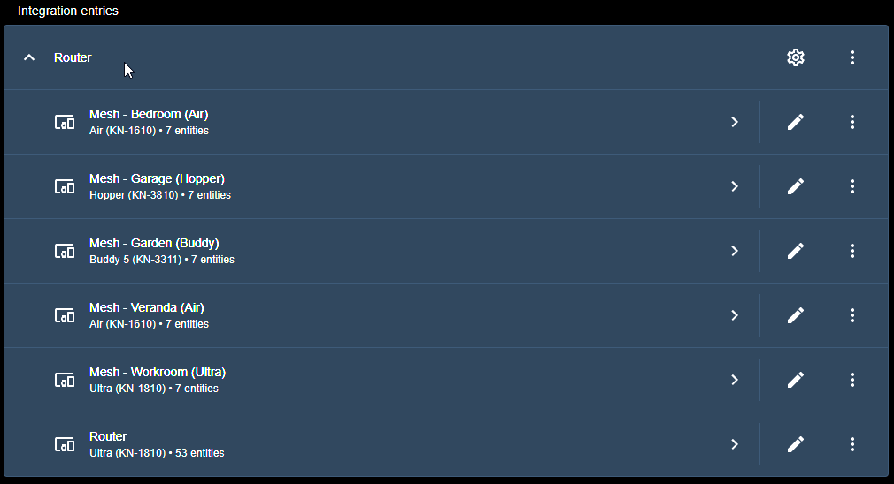
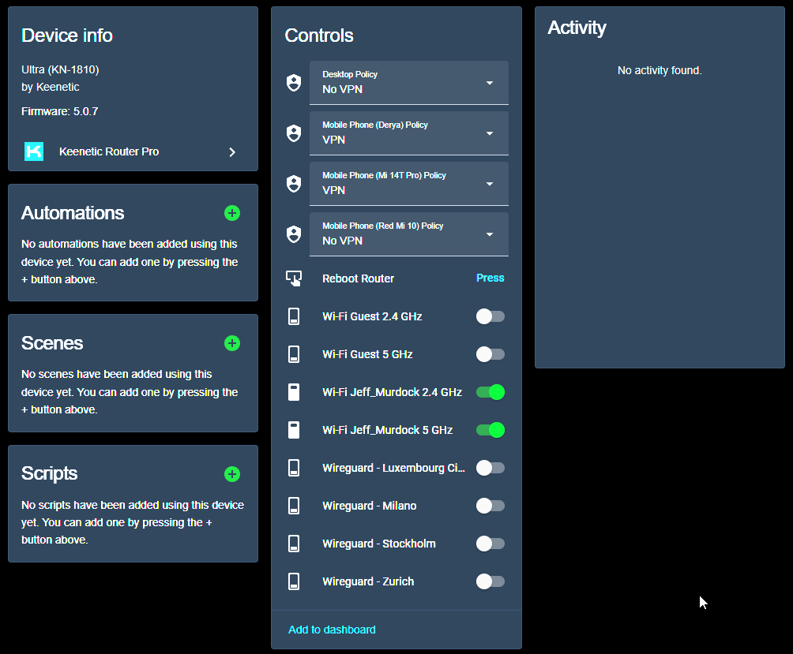
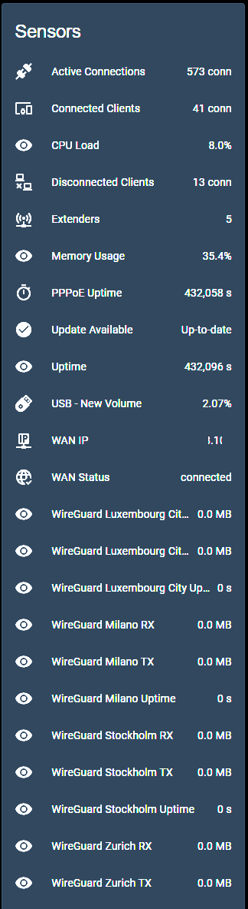
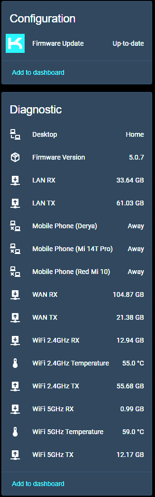
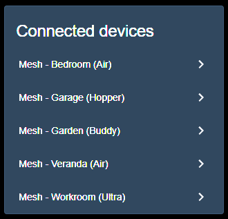
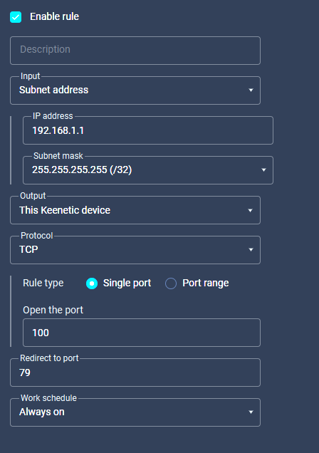
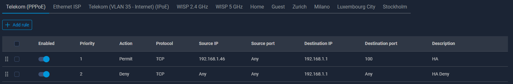

# Keenetic Router Pro - Home Assistant Integration

[](https://github.com/custom-components/hacs)
[](https://github.com/)

<a href="https://www.buymeacoffee.com/cataseven" target="_blank">
  
</a> 

An advanced Home Assistant integration for Keenetic routers. Provides mesh network management, VPN control, device tracking, traffic monitoring, firmware updates, and more.

## 🌟 Features

### 📡 Real Time Device Tracking

* Real-time device status via **ICMP Ping**. You don't need to wait Keenetic's update time for device tracking. This integration pings the devices you selected every 3 seconds.
* Selectable client list
* 3-second update interval
* Automatic updates on IP address changes
> [!IMPORTANT]
> ⚠️ **If Apple iOS devices are registered with client name including 'apple', 'iphone' or 'ipad' then they will NOT be pinged every 3 seconds. Instead, they will sync with the status on the Router's interface. This is because they go into Deep Sleep mode and disable WiFi connection even when they are connected to WiFi.**

### 🔗 Mesh Network Management

* Status of all extenders/repeaters (binary sensors)
* Separate **reboot button** for each mesh node
* CPU, RAM, and uptime information per node
* Firmware version sensor for each node
* **Firmware update entity** with update-available detection
* Number of connected clients (associations) per node
* **Traffic monitoring** per node (WiFi 2.4GHz/5GHz, LAN, WAN RX/TX)
* **WiFi radio temperature** per node (2.4GHz / 5GHz)
* **USB storage** detection on mesh nodes

### 🔄 Firmware Updates

* **Update entity** for the main router (with install + progress support)
* **Update entity** for each mesh node (info-only)
* Firmware version sensor (current version, channel, architecture details)
* Binary sensor for update availability

### 🔐 VPN Management

* Enable/disable WireGuard profiles (switch)
* OpenVPN, IPsec, L2TP, PPTP support
* VPN uptime, RX/TX sensors

### 📶 WiFi Control

* Enable/disable switch for each SSID
* Guest WiFi control

### 🌐 WAN Status

* Real **WAN IP address** (PPPoE supported)
* **3-state connection status**:
  * `connected` — link up and IP address assigned (internet working)
  * `link_up` — link up but no IP address (ISP issue / DHCP waiting)
  * `down` — interface down or not found
* PPPoE uptime sensor

### 📊 Traffic & Diagnostics

* **WiFi 2.4GHz / 5GHz** RX/TX traffic (GB)
* **LAN / WAN** RX/TX traffic (GB)
* **WiFi radio temperature** (2.4GHz / 5GHz)
* Active connections count
* USB storage detection

### 👥 Client Management

* Number of connected / disconnected devices
* **Connection Policy selection** (per client)
  * Default, VPN, No VPN, Smart Home, Roblox, etc.
  * Deny (block internet access)
* **Event trigger** when a new device connects

### 🔘 Buttons

* Router reboot
* Mesh node reboot (separate for each node)

---

  

  



## 📦 Installation

### Via HACS

1. Search for "Keenetic Router Pro" and install
2. Restart Home Assistant

---

## ⚙️ Configuration

### 1. Web management interface must be enabled on the router

### 2. 🔒 Security, Firewall & Port Forwarding

To use this integration **securely**, it is strongly recommended to configure **Firewall rules** and **Port Forwarding** properly on your Keenetic router. This section explains *why* it matters and *how* to do it.

### 3. ⚠️ Why Firewall Configuration Is Important

* Home Assistant communicates with the router via its **web management API**
* Exposing router services directly to the internet **without restrictions** is a security risk
* Proper firewall rules ensure:
  * Only trusted devices (Home Assistant) can access the router
  * No unintended WAN access to router management services

Think of the firewall as a bouncer with a clipboard. Only invited guests get in.

---

### 4. 🔌 Port Forwarding

#### How to Configure Port Forwarding
1. Enable UPnP if it is not
2. Go to **Internet > Port forwarding**
3. Add a new rule:

| Setting       | Value                              |
| ------------- | ---------------------------------- |
| Service       | Home Assistant Router API          |
| Protocol      | TCP                                |
| External Port | `100`                              |
| Internal IP   | Router LAN IP (e.g. `192.168.1.1`) |
| Internal Port | `79`                               |



🚫 **Never expose port 80/443 to WAN without firewall rules**

---

### 5. 🛡️ Firewall Rules (Recommended & Safe)

Use **Firewall rules** to restrict access.

#### Recommended Firewall Setup

1. Go to **Network Rules > Firewall**
2. Create a new rule for your **PPPoE** connection:

| Option      | Value                                   |
| ----------- | --------------------------------------- |
| Direction   | Input                                   |
| Source      | Home Assistant IP (e.g. `192.168.1.50`) |
| Destination | Router                                  |
| Service     | Custom port                             |
| Action      | Allow                                   |

3. Create a second rule:

| Option      | Value        |
| ----------- | ------------ |
| Direction   | Input        |
| Source      | Any          |
| Destination | Router       |
| Service     | Custom port  |
| Action      | Deny         |

✅ Ensure **only Home Assistant** can talk to the router API.



---

### 6. Add the Integration

Settings > Devices & Services > Add Integration > **Keenetic Router Pro**

### 7. Connection Details

| Field              | Description                                                      | Example       |
| ------------------ | ---------------------------------------------------------------- | ------------- |
| Host               | Router IP address                                                | `192.168.1.1` |
| Port               | Web interface port                                               | `100`         |
| Username           | Admin username                                                   | `admin`       |
| Password           | Admin password                                                   | `********`    |
| Use Challenge Auth | Enable for newer models (e.g. Hero) that use NDW2 authentication | `off`         |

> [!NOTE]
> **Use Challenge Auth** is required for newer Keenetic models such as the **Hero** series that use NDW2 challenge-response authentication instead of Basic Auth. If the integration fails to connect on a newer model, try enabling this option. Older models should leave it disabled.

### 8. Select Devices for Tracking and Other Device based managements

During setup, you can choose which devices should be monitored via ping.

---

## 📊 Created Entities

### Main Router

#### Sensors

| Entity | Description | Category |
| ------ | ----------- | -------- |
| CPU Load | CPU usage percentage | — |
| Memory Usage | RAM usage percentage | — |
| Uptime | System uptime in seconds | — |
| WAN Status | Connection state: `connected`, `link_up`, or `down` | — |
| WAN IP | External IP address (PPPoE supported) | — |
| PPPoE Uptime | PPPoE session uptime | — |
| Connected Clients | Number of active clients | — |
| Disconnected Clients | Number of inactive clients | — |
| Extender Count | Number of detected mesh nodes | — |
| Active Connections | NAT connection tracking (conntotal - connfree) | — |
| Firmware Version | Current firmware with release, channel, architecture details | Diagnostic |
| WiFi 2.4GHz Temperature | Radio module temperature | Diagnostic |
| WiFi 5GHz Temperature | Radio module temperature | Diagnostic |
| WiFi 2.4GHz RX / TX | Cumulative traffic in GB | Diagnostic |
| WiFi 5GHz RX / TX | Cumulative traffic in GB | Diagnostic |
| LAN RX / TX | Cumulative traffic in GB | Diagnostic |
| WAN RX / TX | Cumulative traffic in GB | Diagnostic |
| USB Storage | USB device info (if connected) | Diagnostic |

#### Binary Sensors

| Entity | Description |
| ------ | ----------- |
| Firmware Update Available | `on` when a new stable firmware is available |

#### Update

| Entity | Description |
| ------ | ----------- |
| Firmware Update | Shows current/available version, install with progress tracking |

#### Switches

| Entity | Description |
| ------ | ----------- |
| WiFi SSID (per network) | Enable/disable each WiFi network |
| VPN Tunnel (per profile) | Enable/disable WireGuard, OpenVPN, IPsec, L2TP, PPTP |

#### Select

| Entity | Description |
| ------ | ----------- |
| Connection Policy (per tracked client) | Choose access policy: Default, VPN, Deny, etc. |

#### Buttons

| Entity | Description |
| ------ | ----------- |
| Reboot Router | Reboot the main router |

#### Device Tracker

| Entity | Description |
| ------ | ----------- |
| Client Tracker (per tracked client) | ICMP ping-based presence detection (3s interval) |

---

### Per Mesh Node (Extender / Repeater)

Each mesh node appears as a separate device in Home Assistant with the following entities:

#### Sensors

| Entity | Description | Category |
| ------ | ----------- | -------- |
| Uptime | Node uptime in seconds | — |
| Clients | Number of associated clients | — |
| Firmware Version | Current firmware with hardware ID and model details | Diagnostic |

> **Note:** Traffic and temperature sensors are only created for interfaces that exist on the node. Not all extenders have all interfaces.

#### Binary Sensors

| Entity | Description |
| ------ | ----------- |
| Mesh Node Status | `on` when the node is connected |
| Firmware Update Available | `on` when a new firmware is available |

#### Update

| Entity | Description |
| ------ | ----------- |
| Firmware Update | Shows current/available version (info-only, no remote install) |

#### Buttons

| Entity | Description |
| ------ | ----------- |
| Reboot | Reboot this specific mesh node |

---

## 🔔 Events

### `keenetic_router_pro_new_device`

Triggered when a new device connects to the network.

```yaml
automation:
  - alias: "New Device Notification"
    trigger:
      - platform: event
        event_type: keenetic_router_pro_new_device
    action:
      - service: notify.mobile_app
        data:
          title: "🆕 New Device Connected"
          message: "{{ trigger.event.data.name }} ({{ trigger.event.data.ip }})"
```

**Event Data:**

* `mac`: MAC address
* `name`: Device name
* `ip`: IP address
* `hostname`: Hostname
* `interface`: Connected interface
* `ssid`: WiFi SSID (if applicable)

---

## 🌍 Language Support

* 🇬🇧 English
* 🇹🇷 Turkish
* 🇷🇺 Russian

---

## 🔧 Requirements

* Home Assistant 2024.1.0 or newer
* Keenetic router (NDMS 3.x / 4.x / 5.x)
* Web management interface must be enabled on the router

### Tested Models

| Model | Auth Method |
| ----- | ----------- |
| Keenetic Ultra (KN-1810) | Basic Auth |
| Keenetic Hopper (KN-3810) | Basic Auth |
| Keenetic Buddy 5 (KN-3311) | Basic Auth |
| Keenetic Air (KN-1610) | Basic Auth |
| Keenetic Hero (KN-1012) | Challenge Auth (NDW2) |

> [!TIP]
> Not sure which auth method your router uses? Try **Basic Auth** first (default). If the connection fails, switch to **Challenge Auth**.

---

## 🐛 Troubleshooting

### Connection Error

1. Verify router IP address and port
2. Verify username and password
3. Ensure the web interface is enabled on the router
4. If you have a newer model (e.g. **Hero**), enable **Use Challenge Auth** in the integration settings and try again

### Entities Not Appearing

1. Restart Home Assistant
2. Remove and re-add the integration

### Ping Not Working

* Home Assistant must have permission for ICMP ping
* Docker installations may require `network_mode: host`

### WAN Status Shows `link_up` Instead of `connected`

* This means the physical link is up but no IP address was assigned
* Check your ISP connection or PPPoE credentials
* The sensor will change to `connected` once an IP is obtained

### Mesh Node Sensors Missing

* Mesh diagnostics require direct RCI access to each node's IP
* Ensure mesh nodes are connected and reachable from Home Assistant
* Nodes using different credentials than the controller will not report diagnostics

---

## 📄 License

MIT License

---

<a href="https://www.buymeacoffee.com/cataseven" target="_blank">
  
</a> 

**⭐ If you like this project, don't forget to give it a star!**
